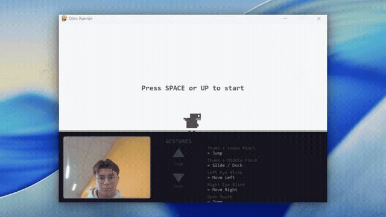
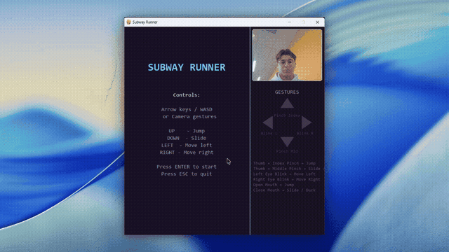

# Games Player

Camera-controlled gaming platform using hand gestures and facial expressions. Play classic games with your webcam or keyboard.

**[Try it live in your browser](https://games-player-app.vercel.app)** -- no install needed, just a webcam and a modern browser.

## Dino Runner

Chrome T-Rex style side-scroller. Jump over cacti and dodge pterodactyls.



## Subway Runner

Dodge trains and barriers in this endless 3-lane runner with a street-art aesthetic.



## Settings

Customize which gestures map to which game actions. Supports hand pinches, eye blinks, and mouth open/close.


## Controls

| Gesture | Default Action |
|---|---|
| Thumb + Index Pinch | Jump |
| Thumb + Middle Pinch | Slide / Duck |
| Left Eye Blink | Move Left |
| Right Eye Blink | Move Right |
| Both Eyes Blink | Not Assigned |
| Open Mouth | Not Assigned |
| Close Mouth | Not Assigned |

Keyboard controls: Arrow keys or WASD, Space to jump.

## Try It Out

### In the browser (recommended)

Visit **[games-player-app.vercel.app](https://games-player-app.vercel.app)** to play instantly. Allow camera access when prompted to use gesture controls, or play with keyboard only.

### Desktop version

```bash
pip install -r requirements.txt
python main.py
```

## Requirements

- Webcam (optional, keyboard always works)
- Desktop: Python 3.8+, opencv-python, mediapipe, pygame
- Web: Any modern browser with HTTPS (Chrome, Firefox, Edge, Safari)
